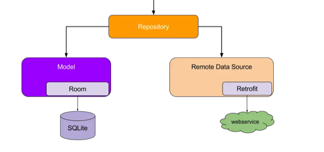

#### InterviewTest

This is a project to test coding skills for an interview I'm participating in.

##### UI Layout -> Domain Layout -> Data Layer

> #### The project follows the SOLID principles, adopts a three-layer design, and adheres to the architecture officially recommended by Google. Each layer only exposes interfaces to the upper layer instead of exposing the implementation, achieving decoupling between layers, which lays a foundation for the future business development.

##### Data Layer

1. The data layer is responsible for storing and retrieving data ,no matter where it comes from.
2. The upper layer of the data layer is only responsible for obtaining and processing data. It doesn't need to care where the data comes from.
3. For example, when the network is unavailable, the setting data can be retrieved from the database or the data store.
   

##### Domain Layer
The domain layer contains use cases. These are classes which have a single invocable method (operator fun invoke) containing business logic.

These use cases are used to simplify and remove duplicate logic from ViewModels. They typically combine and transform data from repositories.

##### UI Layer
The UI layer comprises:

UI elements built using Jetpack Compose
Android ViewModels
The ViewModels receive streams of data from use cases and repositories, and transforms them into UI state. The UI elements reflect this state, and provide ways for the user to interact with the app. These interactions are passed as events to the ViewModel where they are processed.
