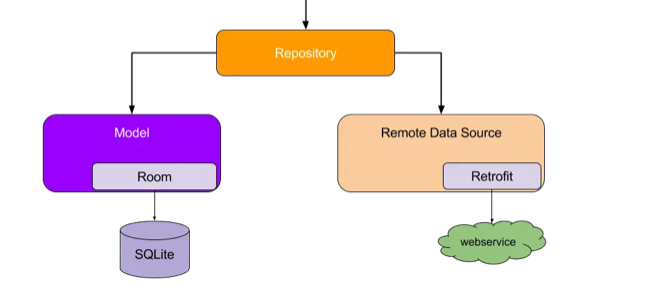

## Data Layer

1. The data layer is responsible for storing and retrieving data ,no matter where it comes from.
2. The upper layer of the data layer is only responsible for obtaining and processing data. It doesn't need to care where the data comes from.
3. For example, when the network is unavailable, the setting data can be retrieved from the database or the data store.
